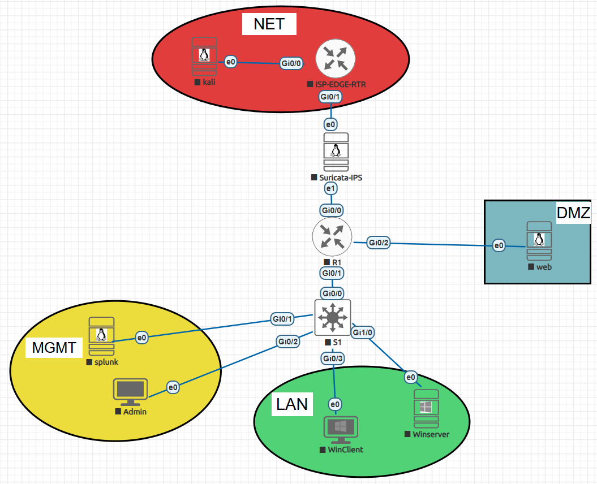

# Splunk SOC Detection Lab

Практическая SOC-лаборатория, созданная для демонстрации навыков: **сбор логов, анализ событий в SIEM, разработка детектов на SPL, расследование Windows-событий, работа с сетевой телеметрией и валидация use case’ов мониторинга**.

Этот проект моделирует небольшую enterprise-like инфраструктуру с **сегментированной сетью**, **Splunk в роли SIEM**, **Windows endpoint и authentication telemetry**, а также **Suricata IPS**, установленной inline для сетевого контроля и наблюдения.

---

## Зачем я сделал эту лабораторию

Эта лаборатория была создана, чтобы выйти за рамки теории и получить практический опыт, приближенный к реальным задачам SOC:

- собирать телеметрию из нескольких источников;
- анализировать Windows- и network-события безопасности;
- строить и проверять детекты в Splunk;
- коррелировать сетевую и хостовую активность;
- оформлять use case’ы и результаты в структурированном техническом виде.

Главная цель этого репозитория — собрать **небольшую, но логичную среду мониторинга**, где инфраструктура, логи, детекты и симуляции активности связаны в единый workflow.

---

## Навыки, продемонстрироваанные в лабораторной работе

Эта лаборатория показывает следующие практические навыки:

- **базовая работа с SIEM на базе Splunk**
- **анализ Windows Event Logs**
- **endpoint visibility через Sysmon**
- **анализ PowerShell logging и suspicious execution**
- **мониторинг аутентификации через Windows Server / AD-события**
- **сетевой мониторинг и базовое предотвращение через Suricata IPS**
- **основы detection engineering**
- **построение use case’ов на SPL**
- **MITRE ATT&CK mapping**
- **базовый incident investigation workflow**
- **Настройка и развёртывание: Splunk SIEM и её компонентов / Suricata**
- **Администрирование ПО, имитирующего сервисы компании**

---

## Цель лаборатории

Лаборатория построена вокруг практической задачи SOC-аналитика:

> собрать телеметрию, воспроизвести подозрительную активность, проверить срабатывание детектов и оформить результаты в виде портфолио-проекта.

Основные задачи:
- развернуть сегментированную SOC-лабораторию;
- централизовать логи в Splunk;
- собирать host, authentication и network telemetry;
- реализовать несколько detection use case’ов;
- валидировать их на контролируемых сценариях;

---

## Архитектура лаборатории



| Host | Interfaces | Default Gateway | Notes |
|---|---|---|---|
| **Kali** | `e0` → NET → `172.16.10.10/24` | `172.16.10.1` | Attack simulation host |
| **ISP-EDGE-RTR** | `Gi0/0` → NET → `172.16.10.1/24`  <br> `Gi0/1` → link to Suricata outside → `no IP`  <br> `Gi0/2` → INTERNET → `DHCP` | `DHCP` on `Gi0/2` | Edge router with NAT and internet access |
| **Suricata IPS** | `ens3` → IPS outside/data → `no IP`  <br> `ens4` → IPS inside/data → `no IP`  <br> `ens5` → MGMT → `10.10.20.50/24` | `10.10.20.1` | Inline IPS with dedicated management interface |
| **R1** | `Gi0/0` → link from Suricata inside → `no IP`  <br> `Gi0/1.10` → MGMT VLAN 10 → `10.10.20.1/24`  <br> `Gi0/1.20` → LAN VLAN 20 → `10.10.10.1/24`  <br> `Gi0/2` → DMZ → `172.16.20.1/24` | - | Inter-VLAN and inter-zone routing |
| **S1** | `VLAN 10 SVI` → MGMT → `10.10.20.2/24`  <br> `VLAN 20 SVI` → LAN → `10.10.10.2/24` | `10.10.20.1` / `10.10.10.1` | Optional switch management IPs |
| **Splunk** | `e0` → MGMT → `10.10.20.10/24`  <br> `e1` → OOB-ACCESS → `192.168.216.10/24` | `10.10.20.1` | SIEM, accessible from MGMT and real laptop |
| **Admin Workstation** | `e0` → MGMT → `10.10.20.20/24` | `10.10.20.1` | Windows admin workstation / jump host |
| **WinServer** | `e0` → LAN → `10.10.10.10/24` | `10.10.10.1` | AD + DNS + authentication telemetry |
| **WinClient** | `e0` → LAN → `10.10.10.20/24` | `10.10.10.1` | Endpoint telemetry source |
| **Web Server** | `e0` → DMZ → `172.16.20.10/24`  <br> `e1` → OOB-ACCESS → `192.168.216.30/24` | `172.16.20.1` | DMZ web service with direct admin access from real laptop |

Лаборатория спроектирована как небольшая enterprise-like среда с несколькими зонами:

- **NET** — внешняя / attacker-зона
- **DMZ** — зона с вынесенным web-сервисом
- **LAN** — внутренняя сеть с рабочей станцией и Windows Server
- **MGMT** — management / monitoring сегмент

### Ключевые узлы

- **Splunk Enterprise** — центральная SIEM
- **Windows Client** — источник endpoint-телеметрии
- **Windows Server** — источник authentication и infrastructure-телеметрии
- **Suricata IPS** — inline-сетевой контроль и источник network alerts
- **Linux Web Server (DMZ)** — внешний сервис для web/network-сценариев
- **Kali Linux** — хост для controlled attack simulation
- **Admin host** — узел управления внутри MGMT-сегмента

### Архитектурные решения

- Splunk вынесен в отдельный **management-сегмент**
- web-сервер расположен в **DMZ**
- Windows Client и Windows Server находятся в **LAN**
- **Suricata размещена inline как IPS** между внешней зоной и внутренней маршрутизацией
- **MGMT и LAN изолированы через VLAN**

Такая структура делает лабораторию значительно более реалистичной, чем обычная “плоская” сеть, и позволяет корректнее строить сценарии мониторинга и расследования.

---

## Моделируемые сценарии атак и подозрительной активности

В лаборатории моделируются не случайные действия, а набор **сценариев**, которые позволяют проверить сбор телеметрии, качество детектов и базовую корреляцию между host-, authentication- и network-источниками.

### 1. Brute force / password spraying с последующим успешным входом
**Суть сценария:** серия неуспешных попыток аутентификации с последующим успешным логоном.  
**Что проверяется:** способность выявлять подозрительную активность вокруг учетных записей и строить корреляцию между failed и successful logon events.  
**Источники:** Windows Security Logs, Windows Server.  
**Практическая ценность:** один из самых типовых сценариев для SOC.

### 2. Encoded PowerShell execution
**Суть сценария:** запуск PowerShell с признаками обфускации, например `-enc` / `-encodedcommand`.  
**Что проверяется:** visibility на уровне процессов, анализ command line и базовая endpoint detection logic.  
**Источники:** Sysmon, Windows Client.  
**Практическая ценность:** демонстрирует понимание suspicious execution patterns.

### 3. Suspicious PowerShell download activity
**Суть сценария:** выполнение PowerShell-команд, связанных с загрузкой удаленного содержимого.  
**Что проверяется:** анализ PowerShell activity, подозрительных команд загрузки и возможная корреляция с сетевой активностью.  
**Источники:** Sysmon, PowerShell logs, Suricata.  
**Практическая ценность:** связывает host telemetry и network context в единый use case.

### 4. Office → PowerShell / cmd execution chain
**Суть сценария:** запуск PowerShell или `cmd.exe` из приложений Office или других нетипичных родительских процессов.  
**Что проверяется:** анализ parent-child process relationships и поведенческие детекты.  
**Источники:** Sysmon, Windows Client.  
**Практическая ценность:** показывает более зрелый подход к detection engineering, чем поиск по одному событию.

### 5. Execution from Temp / AppData / user-writable directories
**Суть сценария:** запуск исполняемых файлов или скриптов из пользовательских или временных директорий.  
**Что проверяется:** detection logic на основе нетипичного расположения исполняемых объектов.  
**Источники:** Sysmon, Windows Client.  
**Практическая ценность:** полезный базовый сценарий для поиска suspicious execution.

### 6. Suspicious traffic toward DMZ services
**Суть сценария:** подозрительная или нетипичная сетевая активность в сторону web-сервера в DMZ.  
**Что проверяется:** видимость сетевой активности на стороне IPS и возможность расследования событий, связанных с exposed service.  
**Источники:** Suricata IPS, DMZ web host.  
**Практическая ценность:** демонстрирует работу с сетевыми событиями и роль DMZ в архитектуре.

### 7. Inline IPS alert / blocking demonstration
**Суть сценария:** controlled test traffic, при котором Suricata не только обнаруживает активность, но и демонстрирует работу как IPS.  
**Что проверяется:** разница между detection и prevention, а также корректность расположения IPS в топологии.  
**Источники:** Suricata IPS.  
**Практическая ценность:** показывает, что сеть в лаборатории используется не только для visibility, но и для базового prevention.

### 8. Suspicious account management activity
**Суть сценария:** действия, связанные с изменениями учетных записей, групп или привилегий на Windows Server.  
**Что проверяется:** мониторинг identity-related events и базовых administrative changes.  
**Источники:** Windows Security Logs, Windows Server.  
**Практическая ценность:** добавляет в лабораторию не только endpoint- и network-сценарии, но и identity-focused monitoring.

---

## Основные источники данных

Проект ориентирован на сбор и анализ данных из нескольких источников.

### Windows Client
- Windows Security logs
- Sysmon
- PowerShell Operational / Script Block logs
- process execution telemetry

### Windows Server
- Security logs
- authentication events
- account management events
- domain / infrastructure-related activity

### Suricata IPS
- alert events
- flow metadata
- protocol-related records (HTTP / DNS / TLS при наличии)

### Linux / DMZ host
- web server logs
- SSH / system logs
- серверная сетевая активность

---

## Suricata rules
### Recon / scanning
#### Nmap SYN Scan
    alert tcp any any -> $HOME_NET any (flags:S; msg:"LAB Nmap SYN scan detected"; threshold:type both, track by_src, count 5, seconds 10; sid:1000003; rev:1;)
#### Ping sweep
    alert icmp any any -> $HOME_NET any (msg:"LAB ICMP sweep detected"; threshold:type both, track by_src, count 10, seconds 5; sid:1000004; rev:1;)

### Web атаки
#### Попытка доступа к admin
    alert http any any -> $HOME_NET any (msg:"LAB Access to /admin detected"; content:"/admin"; http_uri; sid:1000005; rev:1;)
#### Попытка API доступа
    alert http any any -> $HOME_NET any (msg:"LAB API access detected"; content:"/api"; http_uri; sid:1000006; rev:1;)
#### SQL Injection (простая сигнатура)
    alert http any any -> $HOME_NET any (msg:"LAB SQL Injection attempt"; content:"' OR 1=1"; nocase; sid:1000007; rev:1;)

### Brute force (SSH)
    alert tcp any any -> $HOME_NET 22 (msg:"LAB Possible SSH brute force"; threshold:type both, track by_src, count 5, seconds 60; sid:1000008; rev:1;)

### Suspicious DNS
    alert dns any any -> any any (msg:"LAB Suspicious DNS query"; content:"evil.com"; nocase; sid:1000009; rev:1;)

### ICMP flood
    alert icmp any any -> $HOME_NET any (msg:"LAB ICMP flood detected"; threshold:type both, track by_src, count 20, seconds 3; sid:1000010; rev:1;)

---

## На чем сфокусирована лаборатория

Эта лаборатория строится не вокруг “набора инструментов”, а вокруг **практических SOC-детектов**. То есть, фокус строится не только на установке ПО, а на полной цепочке:
**инфраструктура -> телеметрия -> детектирование -> валидация -> документация**

Примеры направлений, которые покрывает проект:

- **Brute force с последующим успешным входом**
- **Encoded PowerShell execution**
- **Подозрительная загрузка через PowerShell**
- **Нетривиальные process execution chains**
- **Корреляция endpoint- и network-событий**
- **Подозрительная активность в сторону внутренних или DMZ-сервисов**

Фокус проекта — не просто написать поисковый запрос, а понять:
- откуда берется телеметрия;
- какие логи нужны для детекта;
- почему этот сценарий важен;
- как его валидировать;
- какие возможны ложные срабатывания;
- какие ограничения есть у правила;
- как расследовать suspicious activity по нескольким источникам;
- как строить детекты вокруг наблюдаемых attacker techniques;
- технически грамотно документировать результаты.

---

## Структура репозитория

```text
.
├── README.md 
├── task.md #сгенерированное + отредактированное задание "лабы"
├── screenshots/ #скриншоты
├── attacks/ #подготовка + сама атака; источники логов; SPL; настройки алерта; его срабатывание; мои мысли и действия по расследованию; MITRE ATT&CK mapping
└── suricata_rules/ #Правила Suricata, используемые в лабе
