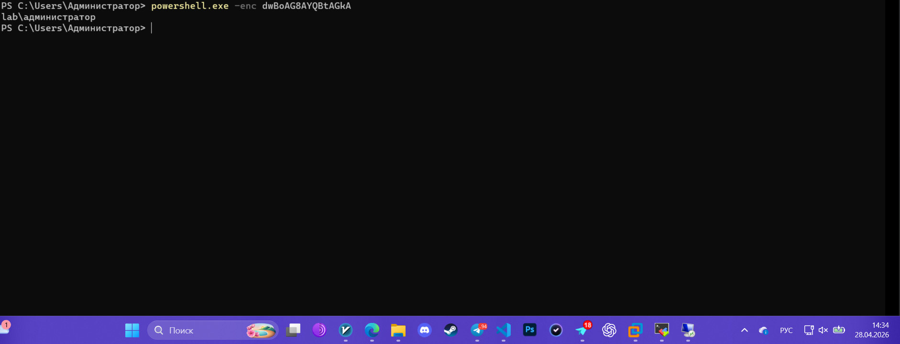
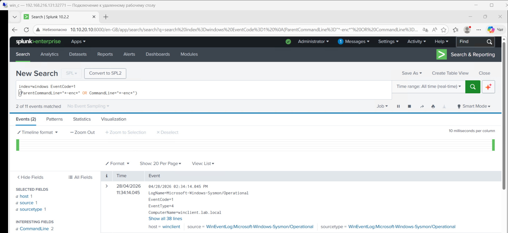
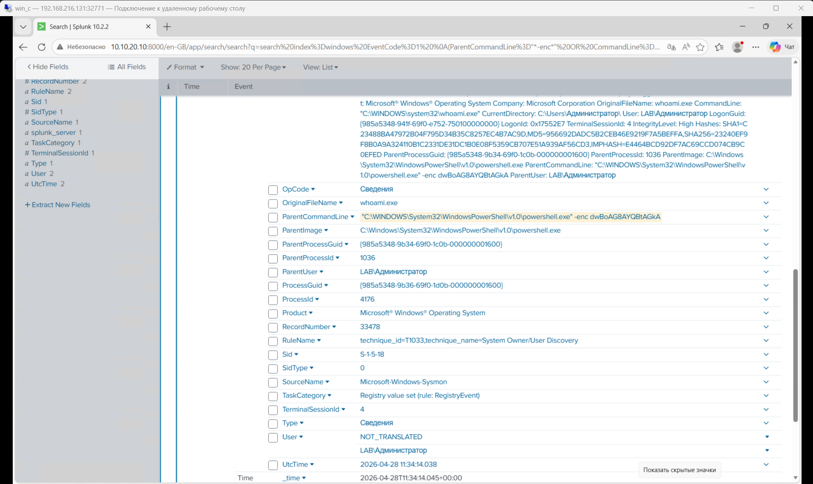
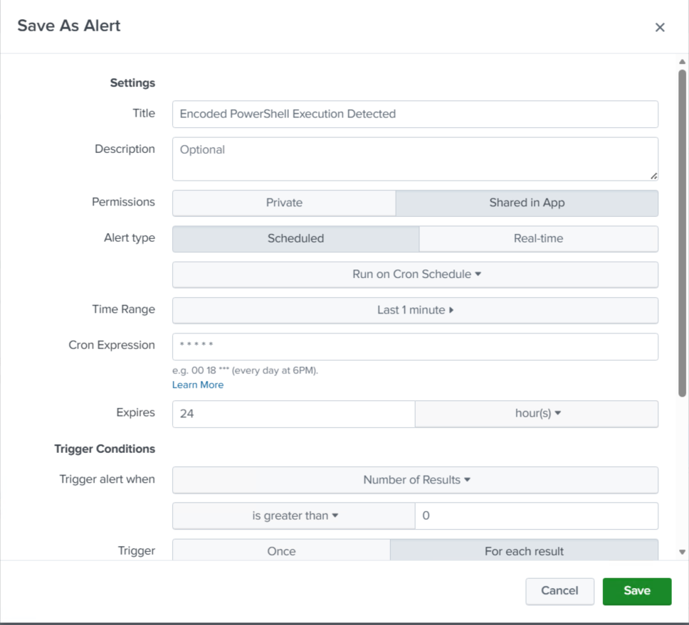
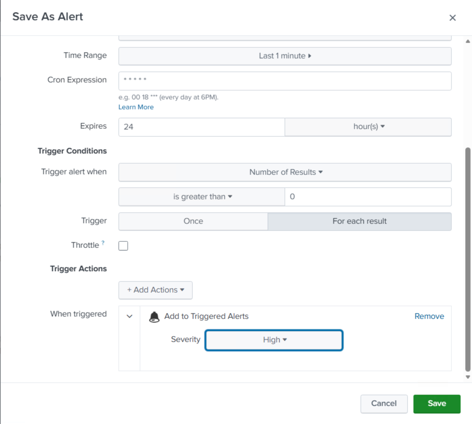
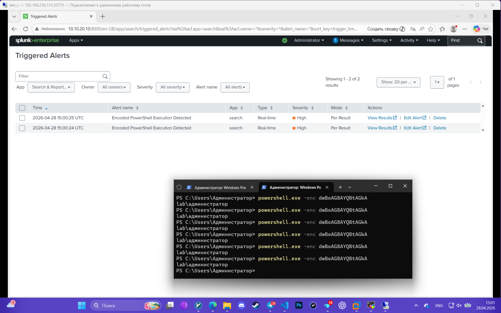
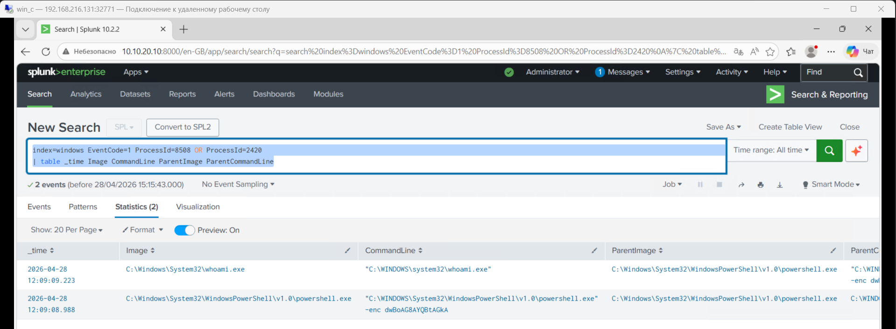

Сгенерируем безвредную encoded powershell команду (whoami), для того, чтобы проверить как Sysmon + конфиг определят атаку.
# 1. Атака
    powershell.exe -enc dwBoAG8AYQBtAGkA

# 2. Источник логов (Data Source)
Sysmon (EventID 1 - ProcessCreate)

Ключевые поля:

ParentCommandLine

ParentImage

Image

CommandLine

# 3. Detection
    index=windows EventCode=1 

    (ParentCommandLine="*-enc*" OR CommandLine="*-enc*")

# 4. alert settings

# 5. triggered alert

# 6. Investigation
Основные поля, которые мы получаем сразу:

Image: whoami.exe

CommandLine: whoami.exe

ParentImage: powershell.exe

ParentCommandLine: powershell.exe -enc dwBoAG8AYQBtAGkA

User: LAB\Администратор

Делаем первичный вывод:
1) Запущена команда whoami, через encoded PowerShell

Ещё полезные поля:

ProcessId: 8508

ParentProcessId: 2420

Теперь выполним:

    index=windows EventCode=1 ProcessId=8508 OR ProcessId=2420
    | table _time Image CommandLine ParentImage ParentCommandLine

Таким образом, я проверяю цепочку процессов (process chain), чтобы понять, какой процесс породил другой процесс.

Т.к. инфраструктура лабораторной ограничена, то опишу свои действия простыми словами:

При обнаружении encoded PowerShell я бы сначала декодировал команду, затем проанализировал цепочку процессов, пользователя и контекст выполнения. Далее проверил бы дополнительные логи (PowerShell, Sysmon, Security), сетевую активность и возможные признаки закрепления или распространения. После этого оценил бы масштаб инцидента (выполнялось ли подобное на других хостах) и при необходимости инициировал меры реагирования.

Использование параметра -enc является типичной техникой обфускации и часто применяется злоумышленниками для обхода средств защиты.

# 7. MITRE ATT&CK mapping
T1059.001 → выполнение PowerShell
       ↓
T1027 → обфускация (-enc)
       ↓
T1033 → сбор информации (whoami)