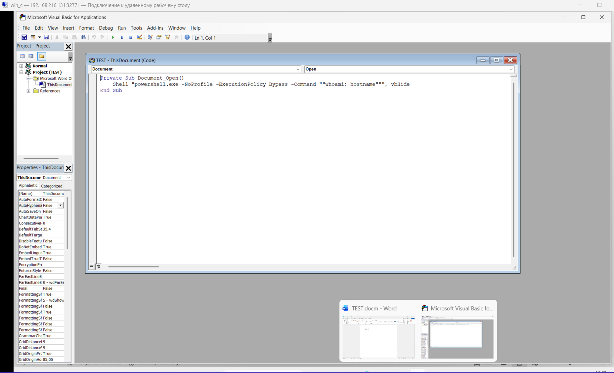
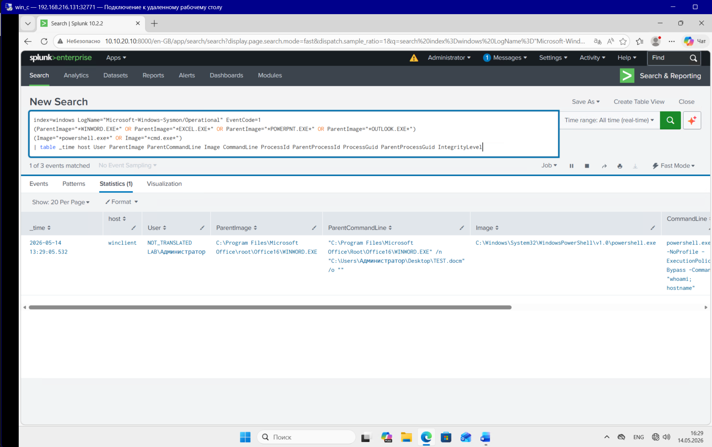
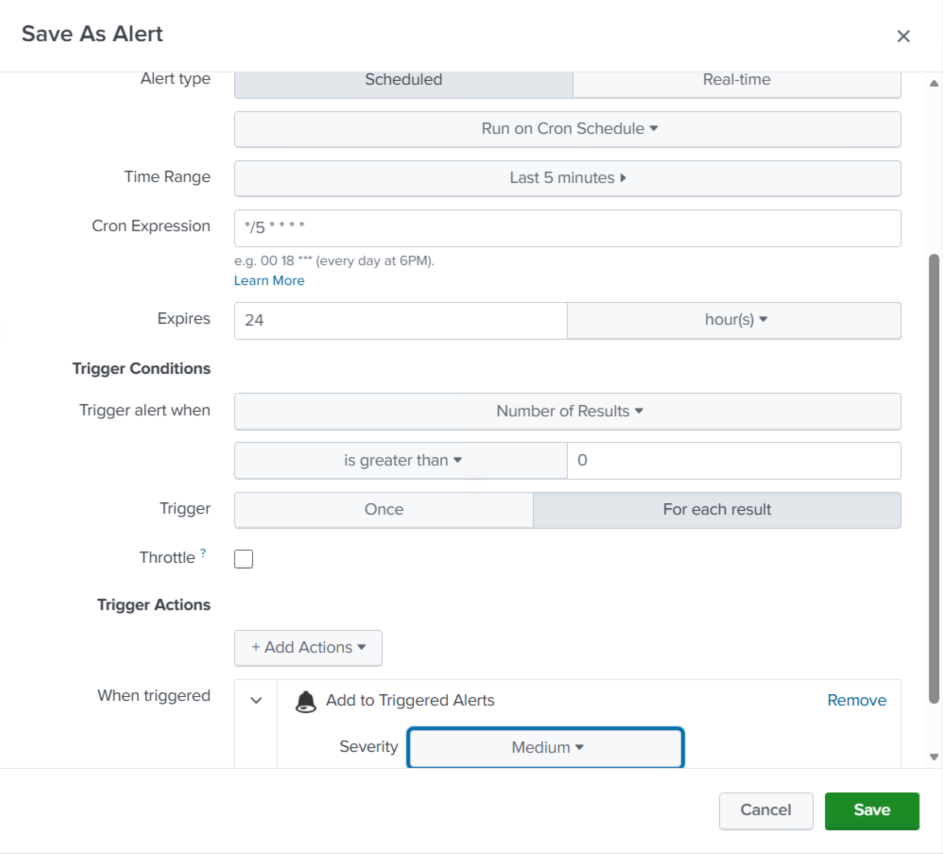
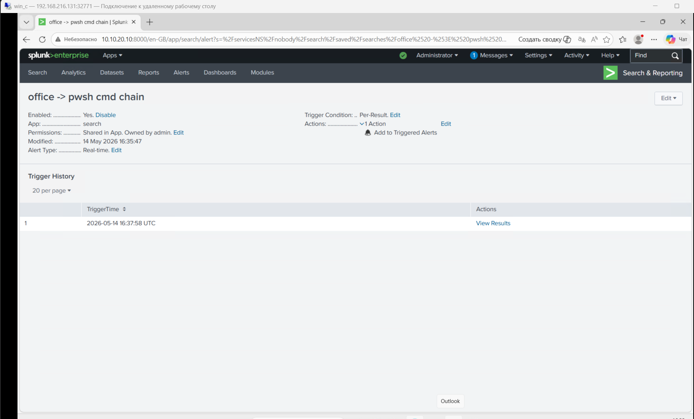
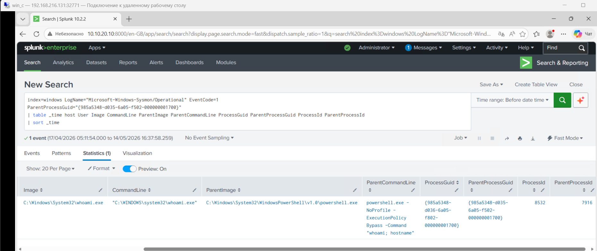

Для эмитации этой атаки, на win client:
1) Установим office
2) Создадим .docm документ

код макроса:
    Private Sub Document_Open()
        Shell "powershell.exe -NoProfile -ExecutionPolicy Bypass -Command ""whoami; hostname""", vbHide
    End Sub

# 1. Атака
Просто запускаем заранее подготовленный нами .docm документ:

# 2. Источник логов (Data Source)
## Sysmon (EventID 1 - Process Create)

Ключевые поля:

ParentImage - родительский процесс, например WINWORD.EXE

ParentCommandLine - командная строка родительского процесса

Image - дочерний процесс, например powershell.exe или cmd.exe

CommandLine - команда, выполненная дочерним процессом

ProcessGuid - уникальный идентификатор созданного процесса

ParentProcessGuid - идентификатор родительского процесса

User - пользователь, от имени которого была выполнена команда

# 3. Detection
    index=windows LogName="Microsoft-Windows-Sysmon/Operational" EventCode=1
    (ParentImage="*WINWORD.EXE*" OR ParentImage="*EXCEL.EXE*" OR ParentImage="*POWERPNT.EXE*" OR ParentImage="*OUTLOOK.EXE*")
    (Image="*powershell.exe*" OR Image="*cmd.exe*")
    | table _time host User ParentImage ParentCommandLine Image CommandLine ProcessId ParentProcessId ProcessGuid ParentProcessGuid IntegrityLevel

# 4. alert settings

# 5. triggered alert

# 6. Investigation
Т.к. инфраструктура лабораторной ограничена, то опишу свои действия простыми словами:

При обнаружении события, где WINWORD.EXE, EXCEL.EXE, POWERPNT.EXE или OUTLOOK.EXE запускает powershell.exe или cmd.exe, я бы сначала проверил цепочку процессов: какой Office-процесс был родителем, какой дочерний процесс был запущен, какая была командная строка, кто был пользователем и на каком хосте это произошло. Затем я бы посмотрел, был ли документ открыт из подозрительного места - например из Downloads, Temp, почтового вложения или сетевой папки. Также я бы проверил, была ли команда простой и ожидаемой или она содержит признаки атаки: -enc, IEX, DownloadString, Invoke-WebRequest, запуск cmd /c, обращение к внешним IP или попытки выполнения скрытых команд.

Также я бы проверил, встречалась ли такая же активность у других пользователей или на других хостах, чтобы понять масштаб инцидента. Если активность выглядела вредоносной, я бы инициировал реагирование: изоляцию хоста, блокировку файла/URL/IP, сбор артефактов, проверку почтового письма или документа-источника и эскалацию в IR/DFIR.

посмотреть, что выполнил PowerShell/cmd после запуска:
    index=windows LogName="Microsoft-Windows-Sysmon/Operational" EventCode=1
    ParentProcessGuid="{PROCESS_GUID_ИЗ_алерта/детекта}"
    | table _time host User Image CommandLine ParentImage ParentCommandLine ProcessGuid ParentProcessGuid ProcessId ParentProcessId
    | sort _time

# 7. MITRE ATT&CK mapping
T1204.002 - User Execution: Malicious File