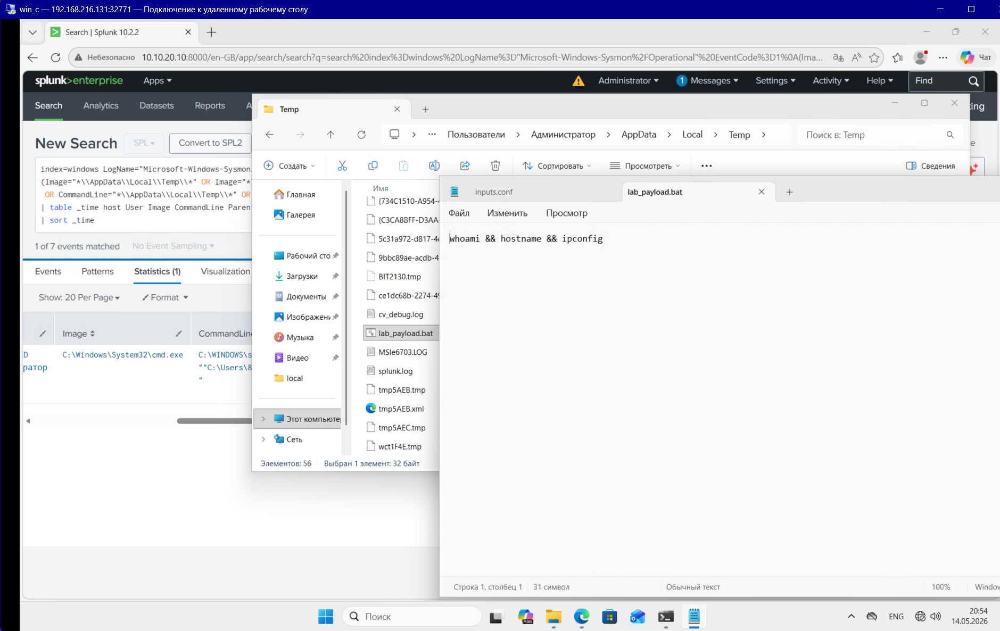
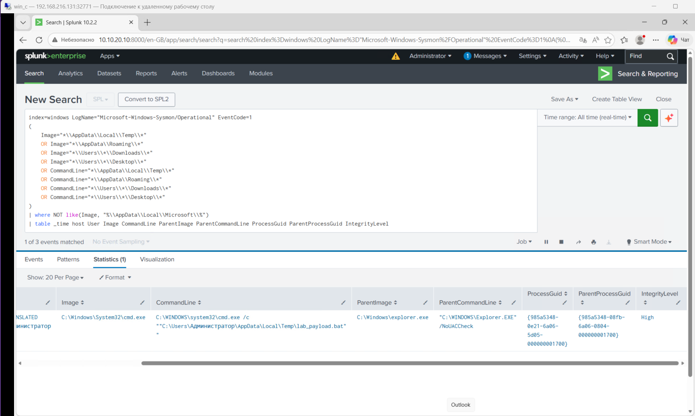
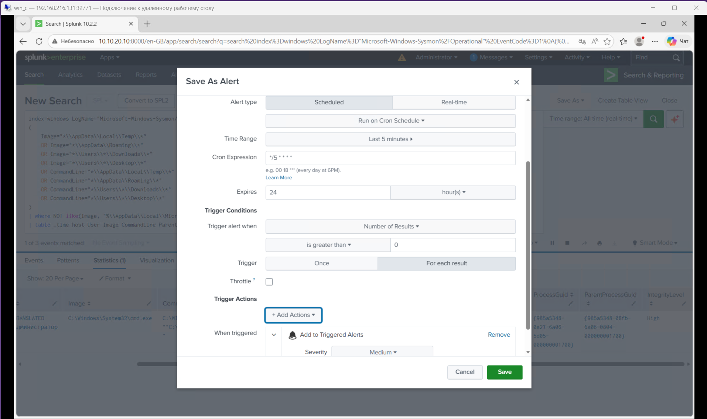
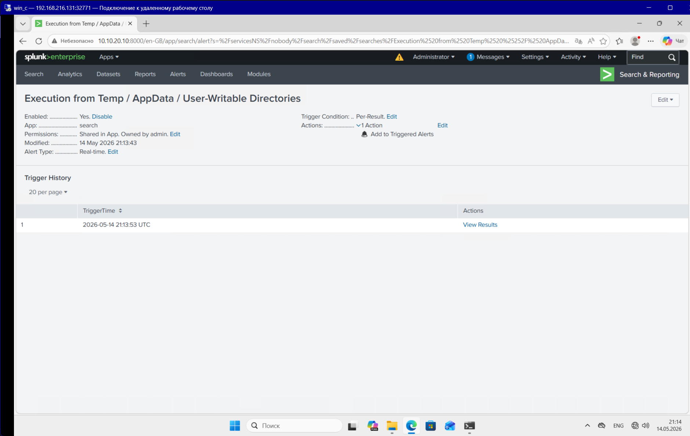
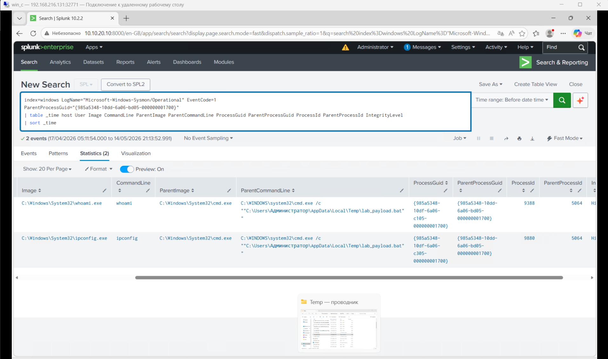

Для имитации этой атаки на Win-клиенте:
1) Создадим `.bat` файл, который содержит безопасные команды.

Для создания можно использовать следующие команды (альтернатива — создать файл вручную):

    $path = "$env:TEMP\lab_payload.bat"
    Set-Content -Path $path -Value "whoami && hostname && ipconfig"
    Start-Process $path$path = "$env:TEMP\lab_payload.bat"
    Set-Content -Path $path -Value "whoami && hostname && ipconfig"
    Start-Process $path

Содержимое файла:

    whoami && hostname && ipconfig

# 1. Атака
Просто запускаем заранее подготовленный батник даблкликом.

# 2. Источник логов (Data Source)
## Sysmon (EventID 1 - Process Create)

Ключевые поля:

Image - путь к запущенному процессу, например файл из Temp или Downloads

CommandLine - полная командная строка запуска процесса

ParentImage - родительский процесс, который запустил файл

ParentCommandLine - командная строка родительского процесса

ProcessGuid - уникальный идентификатор созданного процесса

ParentProcessGuid - идентификатор родительского процесса

User - пользователь, от имени которого был запущен процесс

IntegrityLevel - уровень привилегий процесса

# 3. Detection
    index=windows LogName="Microsoft-Windows-Sysmon/Operational" EventCode=1
    (
        Image="*\\AppData\\Local\\Temp\\*" 
        OR Image="*\\AppData\\Roaming\\*" 
        OR Image="*\\Users\\*\\Downloads\\*" 
        OR Image="*\\Users\\*\\Desktop\\*"
        OR CommandLine="*\\AppData\\Local\\Temp\\*" 
        OR CommandLine="*\\AppData\\Roaming\\*" 
        OR CommandLine="*\\Users\\*\\Downloads\\*" 
        OR CommandLine="*\\Users\\*\\Desktop\\*"
    )
    | where NOT like(Image, "%\\AppData\\Local\\Microsoft\\%")
    | table _time host User Image CommandLine ParentImage ParentCommandLine ProcessGuid ParentProcessGuid IntegrityLevel

В этом детекте используется:

    | where NOT like(Image, "%\\AppData\\Local\\Microsoft\\%")

т.к. в AppData\Local\Microsoft\ часто находятся легитимные пользовательские компоненты Microsoft, которые могут запускаться нормально и создавать шум в алертах (Например, Microsoft Teams/OneDrive/Edge/WebView/Office cache и update components/ClickOnce applications)

# 4. alert settings

# 5. triggered alert

# 6. Investigation
Т.к. инфраструктура лабораторной ограничена, то опишу свои действия простыми словами:

При обнаружении запуска .exe, .bat, .cmd или скрипта из Temp, AppData, Downloads или другой user-writable директории, я бы сначала проверил контекст события: какой файл был запущен, от какого пользователя, на каком хосте, какой процесс был родительским и какая была полная командная строка. Затем я бы посмотрел, является ли этот запуск ожидаемым: например, это может быть легитимный установщик, но также это может быть payload, запущенный из временной папки после загрузки из браузера, почты или PowerShell. Отдельно я бы проверил путь файла, имя, расширение, время создания события и наличие подозрительных признаков в командной строке: cmd, powershell, -enc, DownloadString, внешние IP/URL или запуск с необычными параметрами.

После, я бы оценил последствия: какие дочерние процессы были запущены этим файлом, были ли команды разведки вроде whoami, ipconfig, net user, сетевые подключения, создание новых файлов или попытки закрепления. Также я бы проверил, встречается ли этот же файл, путь или хэш на других хостах, чтобы определить масштаб инцидента. Если активность выглядела вредоносной, я бы инициировал реагирование

посмотреть, что выполнилось после запуска:

    index=windows LogName="Microsoft-Windows-Sysmon/Operational" EventCode=1
    ParentProcessGuid="{PROCESS_GUID_ИЗ_АЛЕРТА}"
    | table _time host User Image CommandLine ParentImage ParentCommandLine ProcessGuid ParentProcessGuid ProcessId ParentProcessId IntegrityLevel
    | sort _time

# 7. MITRE ATT&CK mapping
1) **Tactic:** Initial Access (TA0001)  
    **Technique:** T1204 - User Execution  
    **Sub‑technique:** T1204.002 - Malicious File    

2) **Tactic:** Execution (TA0002)  
    **Technique:** T1059 - Command and Scripting Interpreter  
    **Sub‑technique:** T1059.003 - Windows Command Shell
   
3) **Tactic:** Discovery (TA0007)  
    **Techniques:**
    - T1033 - System Owner/User Discovery (`whoami`)
    - T1007 - System Information Discovery (`hostname`)
    - T1016 - System Network Configuration Discovery (`ipconfig`)
