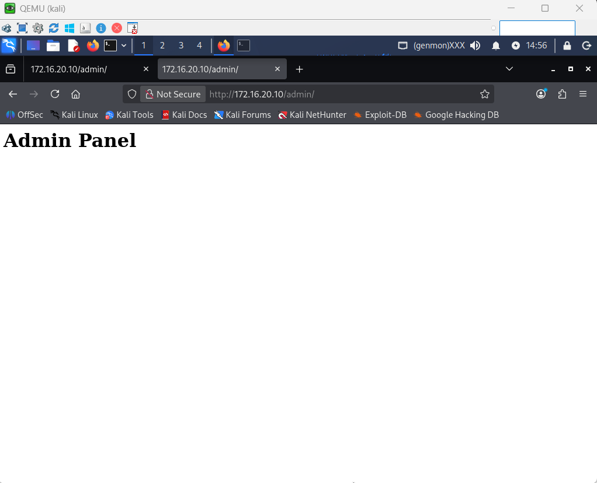
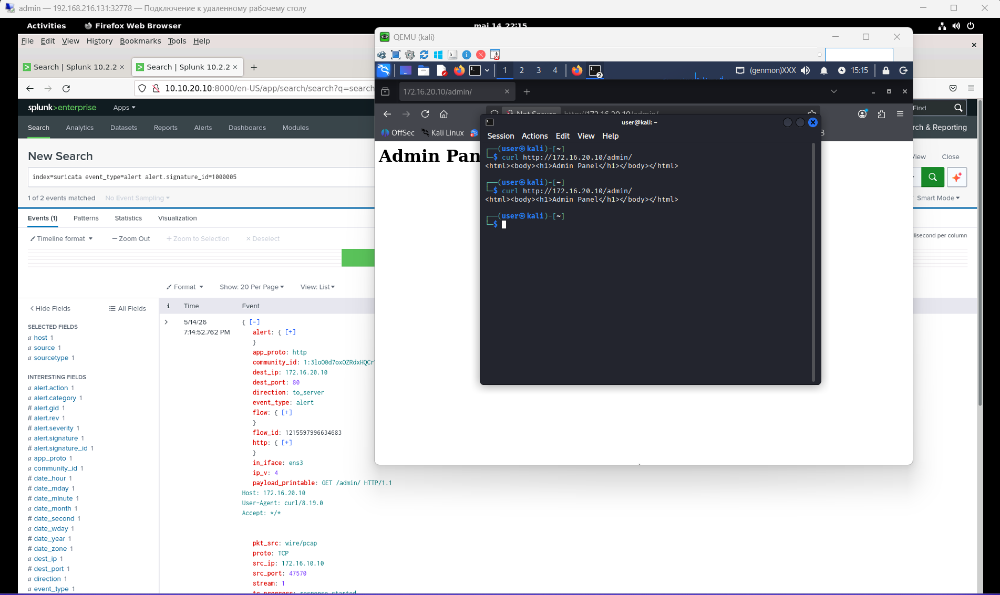
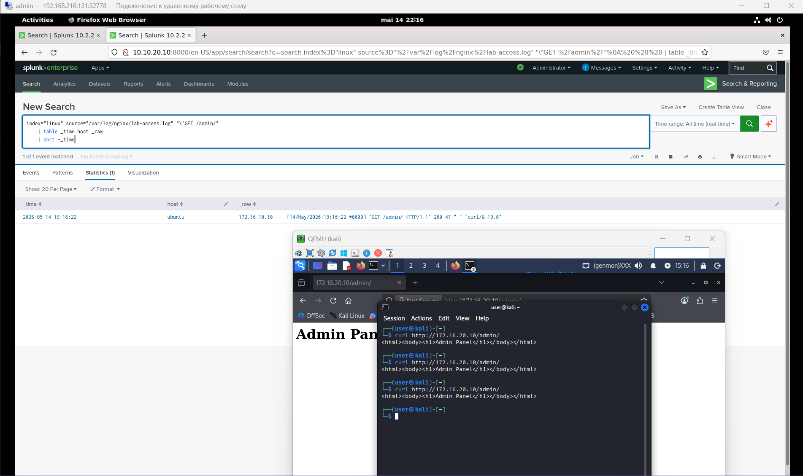
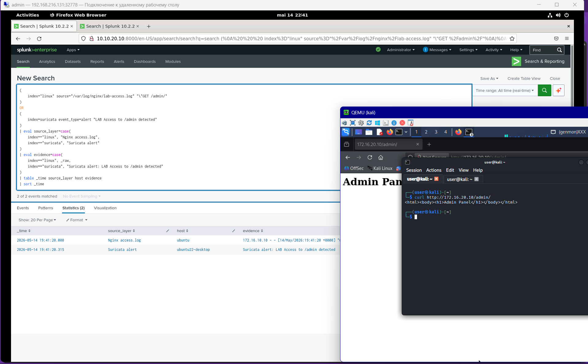
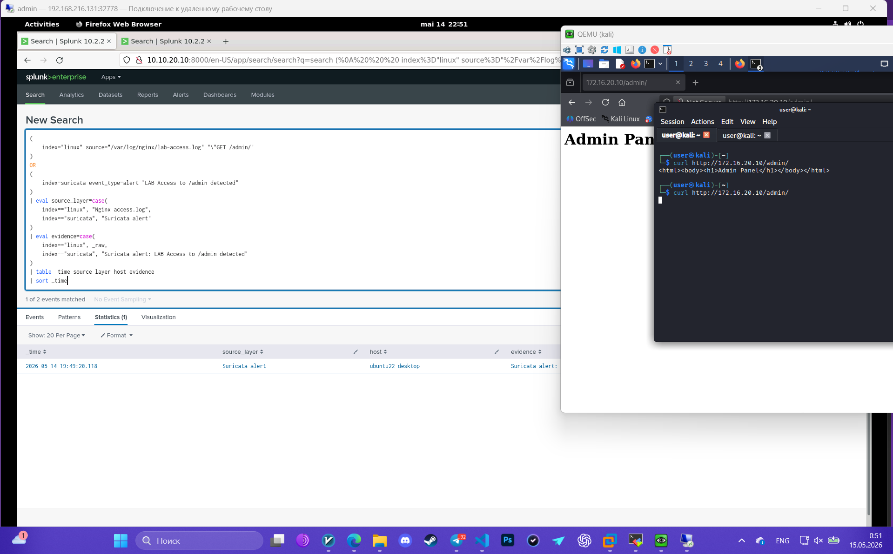
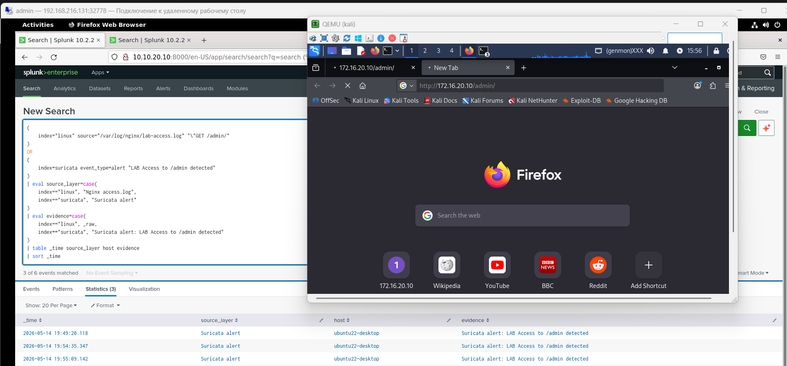
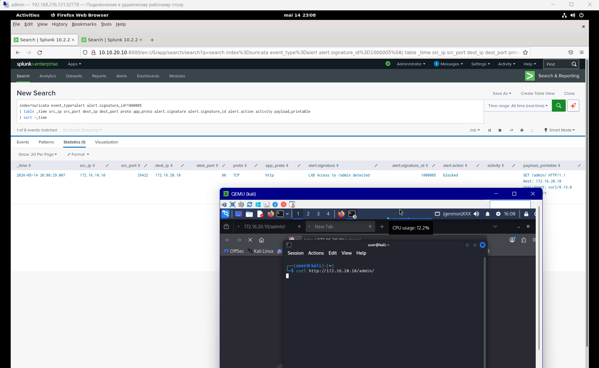
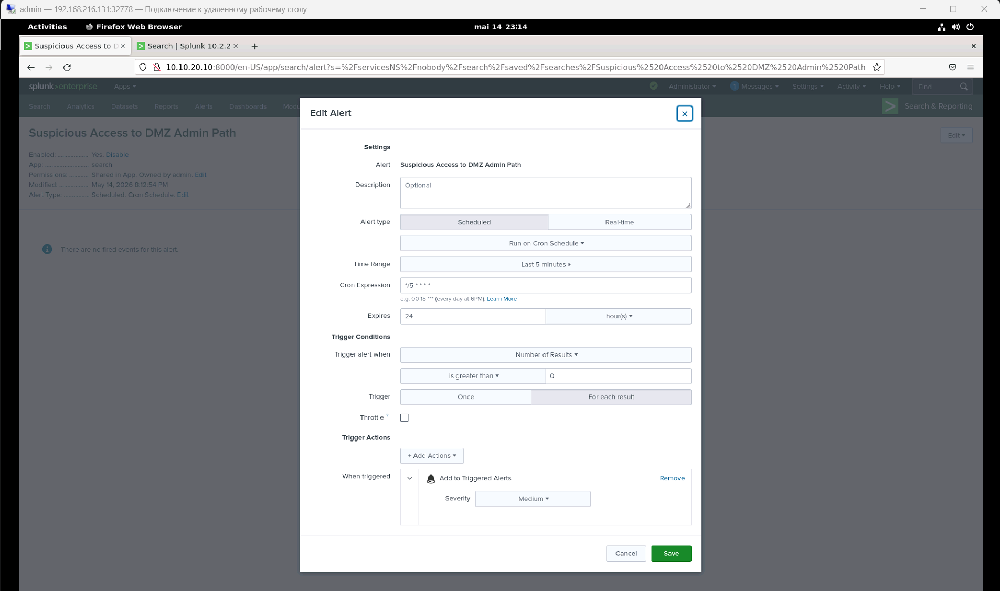
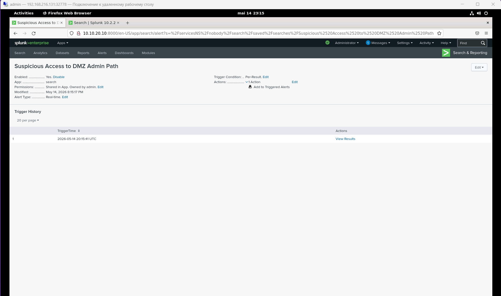
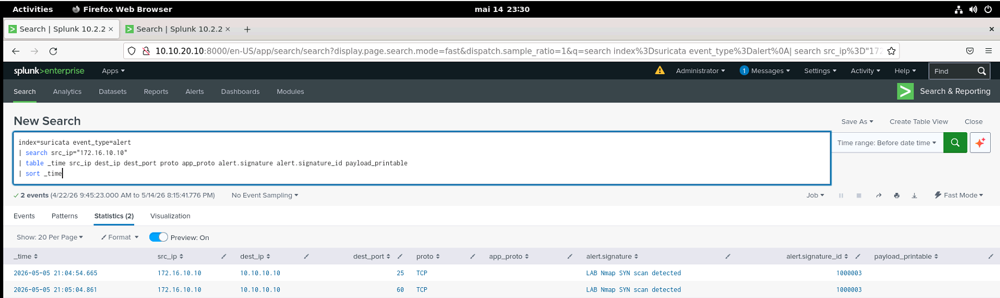

Для имитации этой атаки на Kali:
1) Подготавливаем все необходимые инструменты.
2) Используем одно из заранее написанных правил для Suricata.
# 1. Атака
Попробуем получить доступ к админке с Kali (внешний IP).

Откроем в браузере ссылку "http://172.16.20.10/admin/".

# 2. Источник логов (Data Source)
## Suricata - network layer

network alerts

search:

    index=suricata event_type=alert alert.signature_id=1000005

## websrv - lab-access.log, lab-error.log

web logs

search:

    index="linux" source="/var/log/nginx/lab-access.log" "\"GET /admin/"
    | table _time host _raw
    | sort -_time

# 3. Detection for comparison
Используем этот запрос, чтобы наглядно увидеть разницу между IPS/IDS:

    (
        index="linux" source="/var/log/nginx/lab-access.log" "\"GET /admin/"
    )
    OR
    (
        index=suricata event_type=alert "LAB Access to /admin detected"
    )
    | eval source_layer=case(
        index=="linux", "Nginx access.log",
        index=="suricata", "Suricata alert"
    )
    | eval evidence=case(
        index=="linux", _raw,
        index=="suricata", "Suricata alert: LAB Access to /admin detected"
    )
    | table _time source_layer host evidence
    | sort _time

## NO drop action

## WITH drop action
Чтобы получить drop вместо алерта, просто меняем в правиле alert на drop, итоговое правило:

    drop http any any -> $HOME_NET any (msg:"LAB Access to /admin detected"; content:"/admin/"; http_uri; sid:1000005; rev:1;)

Даже по истечению 3 минут - curl всё ещё висит, лога от nginx не появилось, а suricata отработала моментально.

Браузер, конечно же, после перезагрузки страницы и попытки открыть новую также виснет.

# 4. alert settings
Далее для создания алерта, буду опираться на работу и логи suricata.

Поэтому search:

    index=suricata event_type=alert alert.signature_id=1000005
    | table _time src_ip src_port dest_ip dest_port proto app_proto alert.signature alert.signature_id alert.action activity payload_printable
    | sort -_time

Настройки алерта:

# 5. triggered alert

# 6. Investigation
Т.к. инфраструктура лабораторной ограничена, то опишу свои действия простыми словами:

Данный alert является больше учебной демонстрацией, но в рамках расследования я бы проверил, дошёл ли запрос до DMZ web-сервера, определил источник активности и проверил, были ли рядом по времени другие подозрительные события: сканирование портов, обращения к /api, большое количество 404, попытки SQL injection или повторяющиеся запросы с одного IP. Одиночный запрос к /admin может быть обычным web probing, автоматическим сканированием, ошибочным обращением или частью более широкой разведки. 

Если это одиночный запрос без другой активности, я бы классифицировал его как low/medium severity web probing. Если же тот же источник выполнял scan, перебирал web-пути или отправлял payload’ы вроде SQLi, тогда событие стало бы частью более серьёзного investigation по активности против DMZ service.

проверить, была ли другая активность от этого хоста, подпадающая под наши суриката-алерты(правила):

    index=suricata event_type=alert
    | search src_ip="172.16.10.10"
    | table _time src_ip dest_ip dest_port proto app_proto alert.signature alert.signature_id payload_printable
    | sort _time

# 7. MITRE ATT&CK mapping
**Tactic:** Reconnaissance (TA0043)  
**Technique:** T1595 - Active Scanning  
**Sub‑technique:** T1595.002 - Vulnerability Scanning
               ↓ 
**Related Technique:** T1046 - Network Service Discovery  