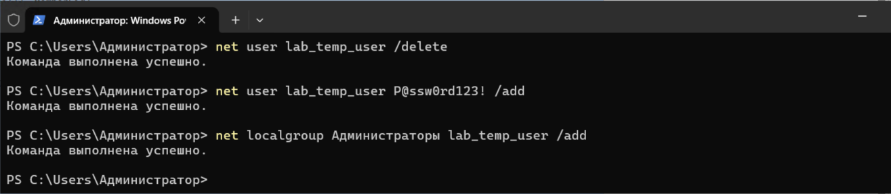
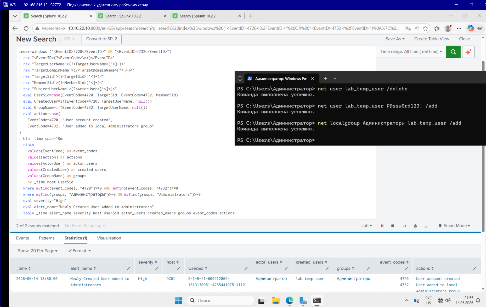
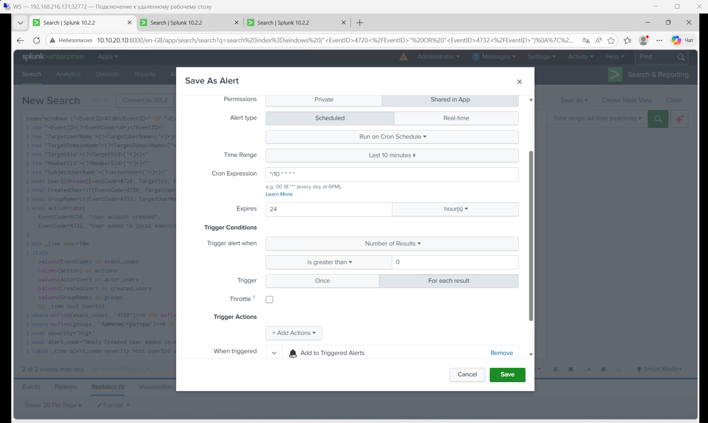
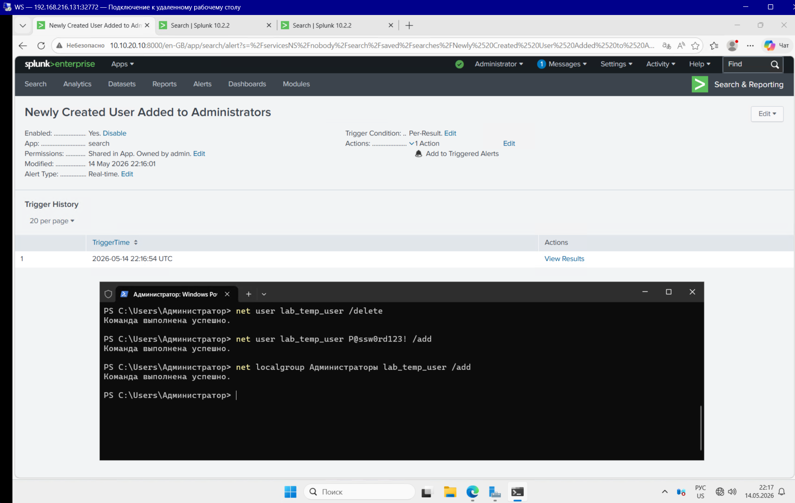
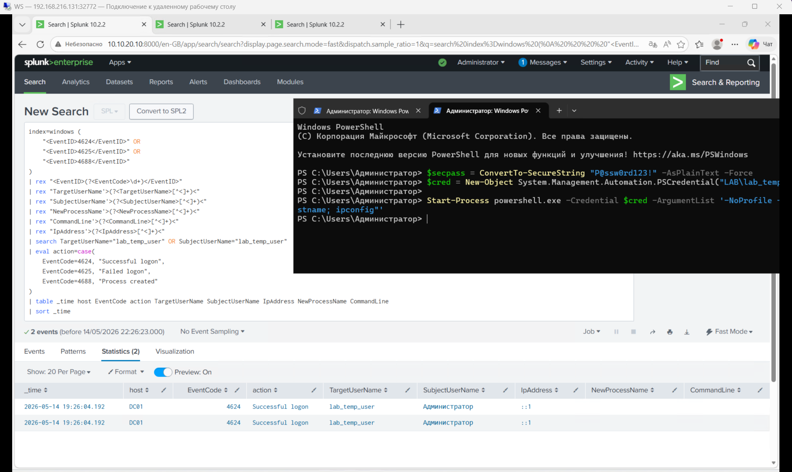

Для эмитации этой атаки, на WS:
1) Необходимо создать нового пользователя
2) Добавить пользователя в группу "Администраторы"

# 1. Атака
Воспользуемся powershell для выполнения действий

Команда для создания пользователя:

    net user lab_temp_user P@ssw0rd123! /add

Команда для добавления пользователя в группу "Администраторы":

    net localgroup Администраторы lab_temp_user /add

# 2. Источник логов (Data Source)
## Windows Security Logs - Account Management Events (4720, 4732)
4720 - создана новая учётная запись

4732 - учётная запись добавлена в локальную группу Administrators / Администраторы

Ключевые поля:

EventCode - тип события Windows Security Log

TargetUserName - имя созданной учётной записи в EventID 4720

TargetSid - SID созданной учётной записи в EventID 4720

MemberSid - SID пользователя, добавленного в группу в EventID 4732

SubjectUserName - пользователь, который выполнил административное действие

TargetDomainName - домен или локальная область действия группы/учётной записи

GroupName - имя группы, куда был добавлен пользователь, например Администраторы

host - сервер, на котором произошло изменение

# 3. Detection
    index=windows ("<EventID>4720</EventID>" OR "<EventID>4732</EventID>")
    | rex "<EventID>(?<EventCode>\d+)</EventID>"
    | rex "TargetUserName'>(?<TargetUserName>[^<]+)<"
    | rex "TargetDomainName'>(?<TargetDomainName>[^<]+)<"
    | rex "TargetSid'>(?<TargetSid>[^<]+)<"
    | rex "MemberSid'>(?<MemberSid>[^<]+)<"
    | rex "SubjectUserName'>(?<ActorUser>[^<]+)<"
    | eval UserSid=case(EventCode=4720, TargetSid, EventCode=4732, MemberSid)
    | eval CreatedUser=if(EventCode=4720, TargetUserName, null())
    | eval GroupName=if(EventCode=4732, TargetUserName, null())
    | eval action=case(
        EventCode=4720, "User account created",
        EventCode=4732, "User added to local Administrators group"
    )
    | bin _time span=10m
    | stats
        values(EventCode) as event_codes
        values(action) as actions
        values(ActorUser) as actor_users
        values(CreatedUser) as created_users
        values(GroupName) as groups
        by _time host UserSid
    | where mvfind(event_codes, "4720")>=0 AND mvfind(event_codes, "4732")>=0
    | where mvfind(groups, "Администраторы")>=0 OR mvfind(groups, "Administrators")>=0
    | eval severity="High"
    | eval alert_name="Newly Created User Added to Administrators"
    | table _time alert_name severity host UserSid actor_users created_users groups event_codes actions

# 4. alert settings

# 5. triggered alert

# 6. Investigation
Т.к. инфраструктура лабораторной ограничена, то опишу свои действия простыми словами:

При обнаружении события, где новая учётная запись была создана и почти сразу добавлена в группу Administrators, я бы сначала проверил, кто выполнил это действие, на каком сервере и в какое время. Затем я бы посмотрел, была ли это плановая административная работа: есть ли заявка, change request или подтверждение от администратора. Отдельно я бы проверил имя созданной учётной записи, её SID, группу, в которую её добавили, и источник активности, чтобы понять, это легитимное администрирование или подозрительное изменение прав.

Если действие незапланированное, то я бы проверил - использовалась ли новая учётная запись для входа в систему, запускались ли от неё процессы, были ли попытки RDP/SMB-доступа или другие действия после добавления в администраторы. Также я бы оценил масштаб, встречались ли похожие изменения на других серверах или с другими аккаунтами. Если активность не подтверждается как легитимная, я бы инициировал реагирование: временно отключил бы учётную запись, удалил её из привилегированной группы, собрал логи, уведомил владельцев системы и эскалировал инцидент в IR/DFIR.

проверить, использовалась ли новая учётная запись после создания:

    index=windows (
        "<EventID>4624</EventID>" OR
        "<EventID>4625</EventID>" OR
        "<EventID>4688</EventID>"
    )
    | rex "<EventID>(?<EventCode>\d+)</EventID>"
    | rex "TargetUserName'>(?<TargetUserName>[^<]+)<"
    | rex "SubjectUserName'>(?<SubjectUserName>[^<]+)<"
    | rex "NewProcessName'>(?<NewProcessName>[^<]+)<"
    | rex "CommandLine'>(?<CommandLine>[^<]+)<"
    | rex "IpAddress'>(?<IpAddress>[^<]+)<"
    | search TargetUserName="lab_temp_user" OR SubjectUserName="lab_temp_user"
    | eval action=case(
        EventCode=4624, "Successful logon",
        EventCode=4625, "Failed logon",
        EventCode=4688, "Process created"
    )
    | table _time host EventCode action TargetUserName SubjectUserName IpAddress NewProcessName CommandLine
    | sort _time

Для быстро получения события для предыдущего запроса:

    $secpass = ConvertTo-SecureString "P@ssw0rd123!" -AsPlainText -Force
    $cred = New-Object System.Management.Automation.PSCredential("LAB\lab_temp_user", $secpass)

    Start-Process powershell.exe -Credential $cred -ArgumentList '-NoProfile -Command "whoami; hostname; ipconfig"'

# 7. MITRE ATT&CK mapping
T1136.001 - Create Account: Local Account
T1098 - Account Manipulation